# 現状アーキテクチャ図（As-Is）

React Native / Expo 移行に向けて、現行 Web 実装（Next.js 16 App Router + Supabase + Zustand）の構造とデータフローを図式化したもの。対象は `src/` 配下すべて（`app/`・`features/`・`lib/`・`stores/`・`i18n/`・`types/`）で、調査メモ `.orch/native-diagrams/T-001`〜`T-003` を統合した。

このコードベースに「クラス」はほぼ存在しない（`MealPhotoStorageError` のみ）。以降の classDiagram は type/interface・関数群・hooks・コンポーネント・モジュールの関係として読むこと。

## 全体データフロー

画面（`app/`）→ features のコンポーネント → Server Action（`features/*/actions.ts`）または `lib/supabase` のブラウザ側ラッパー → Supabase / Stripe。画像・バトル状態・先発パーティは端末内ストレージに留まりサーバーへ送らない。

```mermaid
flowchart TB
  subgraph APP["app/ + src/proxy.ts（ルーティングと組み立てのみ）"]
    Proxy["src/proxy.ts<br/>updateSession（全リクエストのCookie更新）"]
    Root["layout.tsx<br/>NextIntlClientProvider / PwaInstallProvider<br/>/ AppHeader(HeaderAccountSlot)"]
    Shell["(app)/layout.tsx<br/>AppShell + EnsureAnonymousSession"]
    PTitle["page.tsx（タイトル）"]
    PBattle["(app)/battle/page.tsx"]
    PMeals["(app)/meals/page.tsx"]
    PLogs["(app)/logs/page.tsx"]
    PColl["(app)/collection/page.tsx"]
    PReport["(app)/report/page.tsx"]
    PAcct["(app)/account/page.tsx"]
    ROAuth["auth/callback/route.ts"]
    RStripe["api/stripe/webhook/route.ts"]
  end

  subgraph FEAT["features/ + stores/"]
    subgraph FB["features/battle"]
      BScreen["BattleScreen +<br/>CompletionFlow / ArStage 他"]
      BStore["stores/battle-store.ts<br/>useBattleStore（Zustand）"]
      BLogic["battle-runtime / commands / constants /<br/>start-battle / rental 他（純関数群）"]
      BActions["battle/actions.ts<br/>startBattleAction / completeBattleAction"]
      BHooks["battle/hooks<br/>wake-lock / motion / camera / toilet"]
    end
    MUI["features/meal<br/>MealLogForm / PhotoPicker / LogList<br/>+ meal-photo-storage"]
    MAct["meal/actions.ts<br/>save / get / replace / delete"]
    BLogUI["features/bowel-log<br/>BowelLogForm / BattleHistoryList"]
    BLogAct["bowel-log/actions.ts<br/>getBattleHistoryAction"]
    CollUI["features/collection<br/>InventoryScreen + party-lineup"]
    CollAct["collection/actions.ts<br/>getCollectionCharactersAction"]
    RepUI["features/report<br/>WeeklyReportView / TeaserReport<br/>+ 集計純関数群"]
    RepAct["report/actions.ts<br/>getWeeklyReportAction"]
    Pwa["features/pwa<br/>PwaInstallProvider / Promotion"]
    AcctUI["features/account<br/>AccountSection / Header部品"]
    AcctAct["account/actions.ts<br/>getAccountStatusAction"]
    AuthF["features/auth<br/>EnsureAnonymousSession"]
    BillF["features/billing<br/>actions.ts + stripe-event / stripe-env"]
    F2D["features/poopm<br/>PoopmFigure（2D PNG）"]
    F3D["features/poopm-3d<br/>Stage / Solo / Gacha（three + R3F）"]
  end

  subgraph BND["lib/supabase — クライアント生成の許可リスト境界（ESLint強制）"]
    direction TB
    SC["server.ts<br/>createClient + cookies()"]
    BC["client.ts<br/>createBrowserClient"]
    SP["proxy.ts<br/>updateSession"]
    WRAP["ブラウザ側ラッパー<br/>anonymous-session / google-identity /<br/>account-watch / sign-out / auth-callback<br/>/ subscription-write（service role）"]
    ENV["env.ts<br/>公開鍵 / サービスロール分離"]
    SP --> SC
    WRAP --> BC
    SC --> ENV
    BC --> ENV
  end

  subgraph LIBW["lib/ ブラウザAPIラッパー"]
    LM["motion.ts"]
    LW["wake-lock.ts"]
    LC["user-media-camera.ts"]
  end

  SUPA[("Supabase<br/>Auth + Postgres(RLS)<br/>RPC: start_battle /<br/>complete_battle_with_symptoms")]
  STRIPE[("Stripe<br/>Checkout / Portal / Webhook")]
  DBT["types/database.types.ts<br/>（生成型）"]
  I18N["i18n/<br/>locale Cookie → messages"]

  subgraph DEV["端末内・ブラウザAPI（サーバーへ送らない）"]
    IDB[("IndexedDB<br/>meal-photos（画像Blob）")]
    LS[("localStorage<br/>party-lineup / battle-speed / pwa-*")]
    SS[("sessionStorage<br/>battle-store persist v2")]
    GUM["getUserMedia"]
    DME["DeviceMotionEvent"]
    WKL["WakeLock"]
    BIP["beforeinstallprompt"]
    TF["tfjs + coco-ssd<br/>（動的import）"]
  end

  %% app → features
  Proxy --> SP
  Root --> I18N
  Root --> Pwa
  Root --> AcctUI
  Shell --> AuthF
  PTitle --> F2D
  PBattle --> BScreen
  PMeals --> MUI
  PLogs --> BLogAct
  PLogs --> BLogUI
  PColl --> CollAct
  PColl --> CollUI
  PReport --> RepAct
  PReport --> RepUI
  PAcct --> AcctAct
  PAcct --> AcctUI

  %% Route Handler は境界の外。中身はラッパーへ委譲
  ROAuth --> WRAP
  RStripe --> WRAP
  RStripe --> BillF

  %% ブラウザ側の認証入口（client.ts を直接触らない）
  AuthF --> WRAP
  AcctUI --> WRAP
  BScreen --> WRAP

  %% battle 内部
  BScreen --> BStore
  BScreen --> BActions
  BScreen --> BHooks
  BStore --> BLogic
  BScreen -->|"排便入力"| BLogUI
  BScreen -->|"完了後の食事記録"| MUI
  BScreen -->|"先発パーティ読取"| CollUI
  BScreen --> F2D
  BScreen --> F3D
  BStore --> SS

  %% 記録系
  MUI --> MAct
  MUI -->|"Blob保存（openはここだけ）"| IDB
  MUI --> LC
  BLogUI --> BStore
  CollUI --> LS
  RepUI --> BillF
  RepAct --> RepUI
  Pwa --> BIP
  Pwa --> LS
  BScreen --> LS

  %% ブラウザAPI
  BHooks --> LM
  BHooks --> LW
  BHooks --> LC
  BHooks --> TF
  LM --> DME
  LW --> WKL
  LC --> GUM

  %% Server Action → server client（許可リストの主経路）
  BActions --> SC
  MAct --> SC
  BLogAct --> SC
  CollAct --> SC
  RepAct --> SC
  AcctAct --> SC
  BillF --> SC

  %% 境界 → 外部
  SC --> SUPA
  BC --> SUPA
  WRAP -->|"service role（RLS bypass）は<br/>subscription-write のみ"| SUPA
  BillF -->|"Checkout / Portal"| STRIPE
  STRIPE -->|"webhook"| RStripe
  SUPA -.->|"型生成"| DBT
```

読み方の補足：

- **`SC`（`lib/supabase/server`）へ入る矢印は `features/*/actions.ts` と `proxy.ts` 由来だけ**になる。これが許可リスト境界そのもの。
- コンポーネント・Route Handler は `WRAP`（結果型だけを返すラッパー）経由でのみ Supabase に到達する。
- `BScreen` → `MAct` の直接経路は無い。完了時の食事記録は `MUI`（MealLogForm 再利用）→ `MAct` → `SC`、完了確定は `BActions` の RPC のみ。

## Supabase アクセスの許可リスト境界

`docs/architecture.md` ルール3を `eslint.config.mjs` が機械的に強制している。`src/` 全体を既定で禁止し、以下だけを解除する許可リスト方式。

| 許可される場所 | 使うもの |
| --- | --- |
| `features/*/actions.ts` | `lib/supabase/server`（Server Action 経由） |
| `lib/supabase/**` | 各クライアント・ラッパーの実装本体 |
| `src/proxy.ts` | `lib/supabase/proxy`（`updateSession`） |

塞がれている経路: `@/lib/supabase/{client,server}` の静的・動的 import、生の `@supabase/ssr` / `@supabase/supabase-js` の直接利用（`.ts` `.tsx` `.mts` `.js` `.jsx` すべて対象）。Route Handler は許可リストに入っていないため、`auth/callback/route.ts` は `auth-callback.ts` に、`api/stripe/webhook/route.ts` は `subscription-write.ts` + `resolveStripeEvent` に処理を委譲し、クライアントを自分では生成しない。サービスロールは `subscription-write.ts` 内部だけが生成する（RLS バイパス、Stripe Webhook 書き込み専用）。

同じ方式で **IndexedDB 側にも境界がある**: `indexedDB.open` を書けるのは `features/meal/meal-photo-storage.ts` だけ（接続の解放を1か所に閉じ込めるため。解放漏れは `meal-photo-storage.connection.test.ts` が検証）。

## battle 領域

バトル状態は `BattleSnapshot` 1型に集約され、Zustand store が純関数（runtime/commands）へ `set` で橋渡しするだけの構造。開始・完了の2点だけが Server Action 経由で Supabase を触り、進行中はローカル完結する。

```mermaid
classDiagram
direction TB

namespace types["battle.types.ts"] {
  class BattleSnapshot {
    <<type>>
    +status BattleStatus
    +battleId string
    +enemy BattleCombatant
    +party BattleParty
    +stance BattleStance
    +specialGauge number
    +bowelDraft BowelDraft
    +outcomeAcknowledged boolean
  }
  class BattleCombatant
  class BattleParty {
    <<type>>
    3体タプル
  }
  class BattleStartInput
  class BowelDraft
  class StartBattleResult
  class BattleStatus {
    <<union>>
    idle / active / defeated / completing
  }
}

namespace domain["純ロジック層"] {
  class BattleRuntime["battle-runtime.ts"] {
    <<module>>
    applyBattleStart()
    applyBattleTick()
    dealDamage()
  }
  class BattleCommands["battle-commands.ts"] {
    <<module>>
    applySetStance / applySwitchMember
    applyBeginSpecial / applyFireSpecial
    applyMarkCompleting / applyMarkDefeated
    applySetBowelDraft / applyAcknowledgeOutcome
  }
  class BattleConstants["battle.constants.ts"] {
    <<module>>
    computeAttackDamage / typeMultiplier
    tickIntervalMs / autoAttackPeriodTicks
  }
  class SnapshotUtil["battle-snapshot.ts"] {
    <<module>>
    partializeBattleStore
    IDLE_BATTLE_SNAPSHOT / cloneBattleSnapshot
  }
  class ScreenView["battle-screen-view.ts"] {
    <<module>>
    resolveBattleScreenView
  }
  class BattleSpeed["battle-speed.ts"] {
    <<module: localStorage>>
    readBattleSpeed / writeBattleSpeed
    subscribeBattleSpeed
  }
  class StageMotion["battle-stage-motion.ts"] {
    <<module: 状態機械>>
    observeBattleStage / reduceBattleStage
  }
  class SpecialMotionMod["special-motion.ts"] {
    <<module>>
    planSpecialMotion
  }
  class Companionship["companionship-ar.ts +<br/>chance / gravity / toilet-detection"] {
    <<module>>
    nextCompanionshipArPhase / isThrowSwipe
    companionshipChance / screenUpAngleDeg
    pickToiletDetection / mapCoverBBox
  }
  class MealSession["post-battle-meal-session.ts"] {
    <<module>>
    mealLogIdForComplete / lastSessionPhotoId
  }
  class CompleteErr["complete-battle-error.ts"] {
    <<module>>
    messageForCompleteBattleError
  }
}

namespace server["Server Action 側"] {
  class BattleActions["battle/actions.ts"] {
    <<Server Action>>
    startBattleAction
    completeBattleAction
  }
  class StartBattle["start-battle.ts"] {
    <<module>>
    startBattle
  }
  class StartBattleGateway {
    <<interface: Supabase抽象化>>
    getUserId
    findOwnedCharacters
    startBattle
    findCharacterById
    findCharactersByAttribute
  }
  class RentalParty["rental-party.ts"] {
    <<module>>
    fillParty / fillRentalParty
  }
  class EnemyGen["enemy-generator.ts"] {
    <<module>>
    selectEnemyAttribute / selectCharacterFrom
  }
}

namespace ui["components / hooks / store"] {
  class BattleStore["useBattleStore"] {
    <<Zustand store>>
    +persist sessionStorage v2
    start / tick / reset
    setStance / switchMember
    beginSpecial / fireSpecial
  }
  class BattleScreenC["BattleScreen"] <<component>>
  class BattleControls["BattleControls"] <<component>>
  class CompletionFlow["BattleCompletionFlow"] <<component>>
  class OutcomeOverlay["BattleOutcomeOverlay"] <<component>>
  class ArStage["CompanionshipArStage / ArFrame"] <<component>>
  class CompletionResult["BattleCompletionResult"] <<component>>
  class Stage3D["BattleStage3D → Poopm3DStage"] <<component>>
  class UseWakeLock["useBattleWakeLock"] <<hook>>
  class UseSpecialMotion["useSpecialMotion"] <<hook>>
  class UseGachaCamera["useGachaCamera"] <<hook>>
  class UseGravityFloor["useGravityFloorAngle"] <<hook>>
  class UseToiletDetection["useToiletDetection"] <<hook>>
}

class PoopmFigure["PoopmFigure（features/poopm）"] <<component>>
class Poopm3D["features/poopm-3d<br/>Stage/Solo/Gacha"] <<component>>
class SupabaseDB["Supabase RPC / tables"] <<external>>
class SessionStorage["sessionStorage"] <<browser>>

BattleStore ..> BattleSnapshot : 状態
BattleStore ..> BattleCommands : set()で橋渡し
BattleStore ..> BattleRuntime : set()で橋渡し
BattleStore ..> SnapshotUtil : partialize
BattleStore --> SessionStorage : persist

BattleCommands --> BattleRuntime
BattleCommands --> BattleConstants
BattleRuntime --> BattleSnapshot
BattleRuntime --> BattleConstants

BattleScreenC --> BattleStore : 購読 + tick駆動
BattleScreenC --> ScreenView
BattleScreenC --> StageMotion
BattleControls --> BattleStore
CompletionFlow --> BattleActions
BattleScreenC --> BattleActions
OutcomeOverlay --> BattleStore
BattleScreenC --> CompletionFlow
BattleScreenC --> ArStage
BattleScreenC --> CompletionResult
ArStage --> CompletionResult
StageMotion --> Stage3D
BattleScreenC --> UseWakeLock
BattleControls --> UseSpecialMotion
ArStage --> UseGachaCamera
ArStage --> UseToiletDetection
ArStage --> UseGravityFloor
ArStage --> Companionship
UseSpecialMotion --> SpecialMotionMod
CompletionFlow --> MealSession
BattleScreenC --> BattleSpeed

BattleActions --> StartBattle
BattleActions --> CompleteErr
StartBattle ..> StartBattleGateway : 注入ポート
StartBattle --> RentalParty
StartBattle --> EnemyGen
BattleActions --> SupabaseDB : start_battle / complete_battle_with_symptoms RPC

Stage3D --> Poopm3D
ArStage --> Poopm3D
CompletionResult --> Poopm3D
BattleScreenC --> PoopmFigure
```

`BattleStore` はロジックを持たず `battle-commands` / `battle-runtime` の純関数へ `set` で橋渡しする。`StartBattleGateway` は Supabase 操作を注入可能にするポートで、actions.ts が本物を、テストがモックを渡す。`special-button.tsx` は現状どこからも import されない未使用部品（図では省略）。

## 記録系（meal / bowel-log / collection / report / pwa）

```mermaid
classDiagram
direction TB

namespace meal["features/meal"] {
  class MealLogDraft {
    <<type>>
    +foodGroups MealFoodGroup
    +photoId string
  }
  class MealLog {
    <<type>>
    image_path = photoId
  }
  class MealActions["meal/actions.ts"] {
    <<Server Action>>
    saveMealLogAction / getMealLogsAction
    replaceMealLogPhotoAction / deleteMealLogAction
  }
  class MealPhotoStorage["meal-photo-storage.ts"] {
    <<module: IndexedDBのopenはここだけ>>
    saveMealPhoto / getMealPhoto
    deleteMealPhoto / validateMealPhoto
  }
  class MealPhotoStorageError {
    <<Error>>
  }
  class MealLogFormC["MealLogForm"] <<component>>
  class MealPhotoPicker["MealPhotoPicker"] <<component>>
  class MealLogListC["MealLogList"] <<component>>
  class MealLogImageC["MealLogImage"] <<component>>
  class UseMealCamera["useMealCamera"] <<hook>>
}

namespace bowellog["features/bowel-log"] {
  class BowelLog {
    <<type>>
  }
  class BowelLogDraft {
    <<type>>
  }
  class BowelTypesMod["bowel-log.types.ts"] {
    <<module>>
    isBowelLog / getBowelHardnessGroup
  }
  class BowelActions["bowel-log/actions.ts"] {
    <<Server Action>>
    getBattleHistoryAction
  }
  class BowelLogFormC["BowelLogForm"] <<component>>
  class HistoryList["BattleHistoryList"] <<RSC>>
}

namespace collection["features/collection"] {
  class CollectionCharacter {
    <<type>>
    characters + user_characters の3値
  }
  class CollActions["collection/actions.ts"] {
    <<Server Action>>
    getCollectionCharactersAction
  }
  class PartyLineupM["party-lineup.ts"] {
    <<module: localStorage>>
    readPartyLineup / writePartyLineup
    subscribePartyLineup / swapLineupSlot
  }
  class InventoryScreenC["InventoryScreen"] <<component>>
  class CollectionListC["CollectionList"] <<component>>
}

namespace report["features/report"] {
  class ReportResult {
    <<union>>
    entitled true + WeeklyReport
    entitled false + ReportTeaser
  }
  class RepActions["report/actions.ts"] {
    <<server module>>
    getWeeklyReportAction
  }
  class ReportAccessM["report-access.ts"] {
    <<module>>
    hasActiveEntitlement
  }
  class WeeklyReportM["weekly-report.ts"] {
    <<module>>
    createWeeklyReport / getWeeklyReportRange
  }
  class ReportAnalysisM["report-analysis.ts"] {
    <<module>>
    createReportAnalysis
  }
  class BowelMetricsM["bowel-metrics.ts"] {
    <<module>>
    createBowelPeriodMetrics / median
  }
  class TeaserM["teaser-placeholder.ts"] {
    <<module>>
    createTeaserPlaceholder（固定シード）
  }
  class ReportViews["WeeklyReportView / TeaserReport"] <<RSC>>
  class ChartsM["BarChart / ShareBar / TrendLine"] <<RSC>>
  class PurchaseC["PurchaseCallToAction /<br/>ManageSubscriptionLink"] <<component>>
}

namespace pwa["features/pwa"] {
  class PwaInstallM["pwa-install.ts"] {
    <<module>>
    installPromotionKind / isFirstCompletedBattle
  }
  class PwaProviderC["PwaInstallProvider"] <<provider>>
  class PwaPromoC["PwaInstallPromotion"] <<component>>
}

class IndexedDB["IndexedDB meal-photos"] <<browser>>
class LocalStorage["localStorage"] <<browser>>
class BattleStoreR["useBattleStore（bowelDraft）"] <<store>>
class SupabaseR["Supabase（RLS）"] <<external>>
class BillingR["features/billing/actions.ts"] <<ServerAction>>
class CamLib["lib/user-media-camera"] <<module>>

MealPhotoPicker --> MealLogFormC
MealPhotoPicker --> UseMealCamera
UseMealCamera --> CamLib
MealLogFormC --> MealPhotoStorage : Blob保存→photoId
MealLogFormC --> MealActions : onSave(draft)
MealLogListC --> MealActions
MealLogListC --> MealLogImageC
MealLogImageC --> MealPhotoStorage
MealPhotoStorage --> IndexedDB
MealPhotoStorage ..> MealPhotoStorageError
MealActions --> MealLogDraft
MealActions --> SupabaseR

BowelLogFormC --> BattleStoreR : 入力途中はbowelDraftへ
BowelLogFormC ..> BowelLogDraft
BowelLogFormC ..> BowelLog
BowelTypesMod --> BowelLogFormC
BowelTypesMod --> BowelMetricsM
BowelActions --> HistoryList
BowelActions --> SupabaseR

CollActions --> CollectionCharacter
CollActions --> SupabaseR
InventoryScreenC --> CollActions
InventoryScreenC <--> PartyLineupM : useSyncExternalStore
InventoryScreenC --> CollectionListC
PartyLineupM --> LocalStorage

RepActions --> ReportAccessM : 権利判定を先に
RepActions --> WeeklyReportM
WeeklyReportM --> ReportAnalysisM
WeeklyReportM --> BowelMetricsM
RepActions --> ReportResult
RepActions --> SupabaseR
ReportResult --> ReportViews
TeaserM --> ReportViews : 非課金は件数のみ+ダミー
ReportViews --> ChartsM
ReportViews --> PurchaseC
PurchaseC --> BillingR

PwaProviderC --> PwaPromoC
PwaPromoC --> PwaInstallM
PwaPromoC --> LocalStorage
```

要点:

- **画像の境界**: Blob は IndexedDB にしか存在せず、Supabase の `meal_logs.image_path` に入るのは写真ID（UUID）だけ。RN 移行時の代替層は `meal-photo-storage.ts` に閉じている。
- **排便ログの書き込みは battle 側**: `bowel-log` feature は型・フォーム・履歴取得だけで、永続化は `completeBattleAction` → RPC `complete_battle_with_symptoms` が担う。フォームの途中入力は `battle-store.bowelDraft`（sessionStorage persist）へ書く。
- **先発パーティは localStorage**: Supabase に行かず、`party-lineup.ts` が読み書き+手動 subscribe。`InventoryScreen` と `battle-screen` の両方が読む。
- **report の権利境界は actions.ts**: `ReportResult` の union で非課金ブランチに分析値を持たせない。非課金側は `bowel_logs.logged_at` の件数だけを読む。

## 基盤（lib/supabase 境界・認証・課金）

```mermaid
classDiagram
direction TB

namespace boundary["lib/supabase（クライアント生成はここだけ）"] {
  class SupaServer["server.ts"] {
    <<boundary>>
    createClient（cookies橋渡し）
    Server ComponentではCookieを書けない
  }
  class SupaClient["client.ts"] {
    <<boundary>>
    createBrowserClient
  }
  class SupaProxy["proxy.ts"] {
    <<boundary>>
    updateSession(request)
    refresh結果を応答Cookieへ
  }
  class AnonSession["anonymous-session.ts"] {
    <<wrapper>>
    ensureAnonymousSession
    signInAnonymouslyFromBrowser
    refresh token失効→local signOut→再signIn
  }
  class GoogleIdent["google-identity.ts"] {
    <<wrapper>>
    linkIdentity / signInWithOAuth
    linkGoogleIdentityFromBrowser
  }
  class AuthCallbackM["auth-callback.ts"] {
    <<wrapper>>
    exchangeAuthCode
    sanitizeNextPath / buildNextUrl
  }
  class SubWrite["subscription-write.ts"] {
    <<service role>>
    upsertSubscription
    updateSubscriptionStatusByCustomer
    last_event_atで順序逆転防止
  }
  class AcctWatch["account-watch.ts"] {
    <<wrapper>>
    watchAccountStatus(FromBrowser)
  }
  class SignOutM["sign-out.ts"] {
    <<wrapper>>
    signOutFromBrowser
  }
  class SupaEnv["env.ts"] {
    <<module>>
    getSupabaseEnvironment
    getServiceRoleEnvironment（別関数で分離）
  }
}

namespace account["features/account + features/auth"] {
  class AccountStatus {
    <<type>>
    signedIn / isAnonymous / hasGoogleIdentity / email
  }
  class AcctTypesM["account.types.ts"] {
    <<module>>
    toAccountStatus
  }
  class AcctActionsM["account/actions.ts"] {
    <<Server Action>>
    getAccountStatusAction
  }
  class AcctSectionC["AccountSection"] <<component>>
  class GoogleLinkC["GoogleAccountLink"] <<component>>
  class HeaderSlot["HeaderAccountSlot"] <<component>>
  class AccountMenuC["AccountMenu"] <<component>>
  class CallbackNotice["AuthCallbackNotice"] <<component>>
  class EnsureAnon["EnsureAnonymousSession /<br/>AnonymousSignIn<br/>（features/auth）"] <<component>>
}

namespace billing["features/billing"] {
  class BillActionsM["billing/actions.ts"] {
    <<Server Action>>
    createCheckoutSessionAction
    createBillingPortalSessionAction
    匿名・Google未連携はlink-required
  }
  class StripeEventM["stripe-event.ts"] {
    <<module: 純関数>>
    resolveStripeEvent
    upsert / update-by-customer / ignore / invalid
  }
  class StripeEnvM["stripe-env.ts"] {
    <<module>>
    getStripeEnvironment / getStripeWebhookSecret
  }
}

namespace edge["app/ の境界外側"] {
  class ProxyFn["src/proxy.ts"] <<entry>>
  class OAuthRouteH["auth/callback/route.ts"] <<RouteHandler>>
  class WebhookH["api/stripe/webhook/route.ts"] <<RouteHandler>>
}

class SupabaseE["Supabase Auth + Postgres"] <<external>>
class StripeE["Stripe"] <<external>>
class FeatureActions["features/*/actions.ts<br/>（meal/battle/bowel-log/<br/>collection/report/billing）"] <<allowlist>>
class ReportAccessRef["report/report-access.ts<br/>hasActiveEntitlement"] <<module>>

note for SupaServer "import可: features/*/actions.ts / lib/supabase/** / proxy.ts のみ（ESLint no-restricted-imports + syntax）"
note for OAuthRouteH "許可リスト外。クライアントを生成せずauth-callback.tsへ委譲"

ProxyFn --> SupaProxy
SupaProxy --> SupaServer
SupaServer --> SupaEnv
SupaClient --> SupaEnv
SupaServer --> SupabaseE
SupaClient --> SupabaseE

AnonSession --> SupaClient
GoogleIdent --> SupaClient
AcctWatch --> SupaClient
SignOutM --> SupaClient
AuthCallbackM --> SupaServer
SubWrite --> SupabaseE : service role（RLS bypass）
SubWrite --> SupaEnv : サービスロールenv

FeatureActions --> SupaServer
AcctActionsM --> SupaServer
BillActionsM --> SupaServer

HeaderSlot --> AcctWatch
HeaderSlot --> AnonSession
EnsureAnon --> AnonSession
AcctSectionC --> AcctWatch
GoogleLinkC --> GoogleIdent
AccountMenuC --> SignOutM
AcctSectionC --> AcctActionsM
AcctTypesM --> AccountStatus
CallbackNotice ..> AccountStatus

OAuthRouteH --> AuthCallbackM
WebhookH --> StripeEventM
WebhookH --> SubWrite
WebhookH --> StripeEnvM

BillActionsM --> StripeE : checkout/portal session
BillActionsM --> ReportAccessRef
StripeE --> WebhookH : webhook
StripeEventM --> SubWrite
```

認証フローの要点（詳細なシーケンスは T-003 メモ参照）:

- 匿名セッションはブラウザ側で作る。`HeaderAccountSlot`（全画面）と `EnsureAnonymousSession`（`(app)` 配下）が `signInAnonymouslyFromBrowser` を呼び、`anonymous-session.ts` が refresh token 失効を検出して local signOut → 再 `signInAnonymously()`。
- Google 昇格は `linkIdentity`（ブラウザ側リダイレクト）→ `/auth/callback` で `code` をセッション化。`?next=` は `sanitizeNextPath` で同一オリジン絶対パスに限定。`auth_linked` はサーバー実測の `hasGoogleIdentity` と照合してから成功扱い。
- Cookie 更新は全リクエストで `src/proxy.ts` → `updateSession` が行う（`server.ts` は Server Component から Cookie を書けないので `setAll` で握り、実更新は proxy に任せる）。
- Stripe の整合は「イベント順序を信用しない」設計: checkout 完了系は `subscriptions.retrieve` で期限を取り直し、`last_event_at` より古いイベントは `subscription-write` 側で適用しない。

## 端末内ストレージ・ブラウザAPIの所在まとめ

| 領域 | 所在 | 移行時のポイント |
| --- | --- | --- |
| IndexedDB | `features/meal/meal-photo-storage.ts`（open はここだけ・ESLint強制） | FileSystem / AsyncStorage 系への置き換えはこのファイルに閉じる |
| localStorage | `collection/party-lineup.ts`、`battle/battle-speed.ts`、`pwa/` | 小さな自作ストア + `useSyncExternalStore` で購読 |
| sessionStorage | `stores/battle-store.ts`（Zustand persist v2、形式不一致は捨てる） | 未完了バトル＋排便ドラフトの復元専用 |
| getUserMedia | `lib/user-media-camera.ts` → `use-meal-camera` / `use-gacha-camera` | 映像は state / 永続層に入れない |
| DeviceMotionEvent | `lib/motion.ts`（権限+踏ん張り積算）、`use-gravity-floor`（許可要求なし） | iOS `requestPermission` はユーザー操作内でのみ呼ぶ |
| WakeLock | `lib/wake-lock.ts` → `use-battle-wake-lock` | バトル中だけ保持、ベストエフォート |
| beforeinstallprompt | `features/pwa`（Provider + Promotion、localStorageで出し分け） | RN では不要になる領域 |
| three / R3F | `features/poopm-3d`（`next/dynamic ssr:false` で包む） | Expo 移行時は描画層ごと要検討 |
