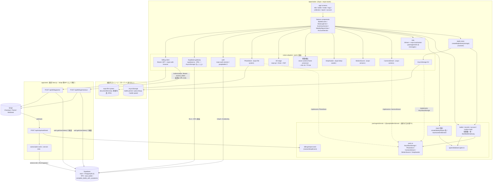
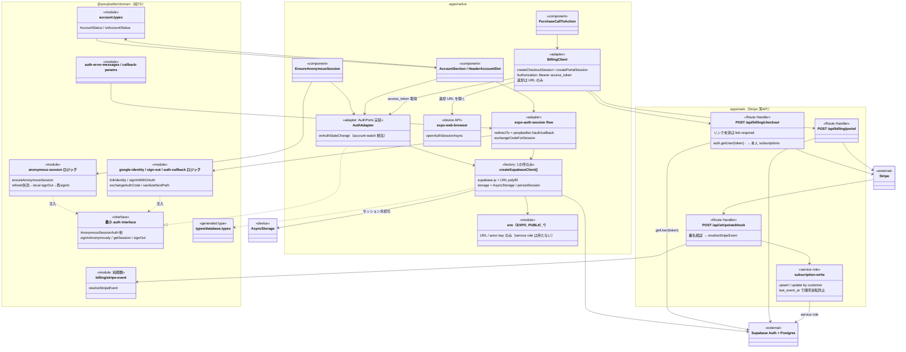
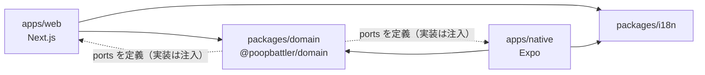

# 理想アーキテクチャ図（To-Be）

React Native / Expo 移行後の目指す姿。現状は [current-architecture.md](./current-architecture.md)、根拠は [migration-proposal.md](./migration-proposal.md)（提案§1〜§4）。

このコードベースに「クラス」はほぼ存在しない。以降の classDiagram は type/interface・関数群・モジュール・パッケージ境界の関係として読むこと。

## 承認済みの前提

1. **バックエンドは案C**: データ面は Supabase 直結（RLS + RPC）。Stripe 系のみ既存 Next.js を薄い API として残す（`POST /api/billing/checkout`、`POST /api/billing/portal`、`POST /api/stripe/webhook`）。
2. **3D 描画は維持**: `expo-gl` + `three.js` + R3F で移植する。
3. **便器検出は維持**: `react-native-vision-camera` フレームプロセッサ + ML Kit / TFLite。
4. **レポート課金ゲートは現状同等**: 集計はクライアント側の共有層で実行し、非課金者には結果ペイロードを渡さない（列絞り込み規律を踏襲）。

RN/Expo 化で消えるもの: Server Action・Server Component・`proxy.ts`・`next/dynamic`・`next-intl`・PWA 基盤。残るもの: Supabase（Auth + Postgres + RLS + RPC）、Stripe、ドメインの純粋関数層。ブラウザ版も既に Supabase セッションを持っているため、直結化でデータ露出モデルは変わらない（RLS が境界）。

## 全体データフロー

現状との最大の違いは、Server Action 層と `lib/supabase` 許可リスト境界が消え、代わりに **`@poopbattler/domain`（純TS・依存ゼロ）+ adapters（ports の実装）** が中心になること。Supabase へは native の adapter から直接、Stripe 系だけ Bearer JWT 付きで Next.js API を経由する。



読み方の補足：

- Supabase を触るのは **`ASB`（gateway adapter）と `AAUTH` だけ**。現状の「許可リスト境界」は ESLint ではなく **パッケージ境界**（`domain` は SDK 実装を import しない）に置き換わる。
- 画面更新のための `revalidatePath` は不要。mutation 結果をローカル状態へ反映するか、再取得（invalidation）で足りる。
- Stripe 経路だけがサーバー必須（secret key / service role）。native は Checkout/Portal の URL を受け取り `expo-web-browser` で開く。
- 食事写真の Blob は現状同様サーバーに行かず、`meal_logs.image_path` には写真 ID（UUID）だけが入る。

## 主要領域のクラス図

### battle 領域（共有 domain 層 + native アダプタ + store）

現状の `StartBattleGateway` DI パターンを全境界に広げ、store もストレージ注入の factory にする。`battle-speed` / `party-lineup` は読み書きだけ adapter 側へ分離する。

```mermaid
classDiagram
direction TB

namespace domain["@poopbattler/domain/battle（純TS）"] {
  class BattleSnapshot {
    <<type>>
    status / battleId / enemy / party
    stance / specialGauge / bowelDraft
  }
  class BattleRuntime["battle-runtime / battle-commands"] {
    <<module>>
    applyBattleStart / applyBattleTick
    applySetStance / applyFireSpecial 他
  }
  class BattleConstants["battle.constants"] {
    <<module>>
    computeAttackDamage / typeMultiplier
  }
  class SnapshotUtil["battle-snapshot"] {
    <<module>>
    partializeBattleStore / cloneBattleSnapshot
  }
  class StartBattle["start-battle / rental-party / enemy-generator"] {
    <<module>>
    startBattle(gateway)
  }
  class StartBattleGateway {
    <<interface>>
    getUserId
    findOwnedCharacters
    startBattle
    findCharacterById
    findCharactersByAttribute
  }
  class CompleteLogic["complete-battle-error / post-battle-meal-session"] {
    <<module>>
    messageForCompleteBattleError
    mealLogIdForComplete
  }
  class CompanionLogic["companionship-ar / chance / gravity / toilet-detection"] {
    <<module>>
    isThrowSwipe / companionshipChance
    pickToiletDetection / mapCoverBBox
  }
  class StageMotion["battle-stage-motion / special-motion"] {
    <<module: 状態機械>>
    reduceBattleStage / planSpecialMotion
  }
  class FirstBattle["isFirstCompletedBattle"] {
    <<function: pwa 依存から分離>>
  }
  class SpeedLogic["battle-speed（リスナー機構のみ）"] {
    <<module>>
  }
  class Ports["ports.ts"] {
    <<interface>>
    KeyValueStorage
    PhotoStore
    CameraStream
    MotionSource
    KeepAwake
  }
}

namespace native["apps/native"] {
  class BattleStoreFactory["createBattleStore(storage)"] {
    <<Zustand factory>>
    persist version / migrate
    start / tick / reset / setStance 他
  }
  class SupabaseGateway["SupabaseStartBattleGateway"] {
    <<adapter>>
    supabase.rpc start_battle
    user_characters / characters select
  }
  class CompleteAdapter["completeBattle adapter"] {
    <<adapter>>
    rpc complete_battle_with_symptoms
    battle_results 読み戻し
  }
  class AsyncKV["AsyncStorageKV"] {
    <<adapter: KeyValueStorage>>
  }
  class ExpoCamera["ExpoCameraStream"] {
    <<adapter: CameraStream>>
  }
  class ExpoMotion["ExpoMotionSource"] {
    <<adapter: MotionSource>>
  }
  class ExpoKeepAwake["ExpoKeepAwake"] {
    <<adapter: KeepAwake>>
  }
  class ToiletDetector["VisionCameraToiletDetector"] {
    <<adapter>>
    frame processor + ML Kit / TFLite
  }
  class BattleScreenN["BattleScreen"] <<component>>
  class CompletionFlowN["BattleCompletionFlow"] <<component>>
  class ArStageN["CompanionshipArStage"] <<component>>
  class Stage3DN["Battle stage（expo-gl + R3F）"] <<component>>
  class AppStateTick["AppState 連動 tick 駆動"] <<hook>>
}

class SupabaseDB["Supabase RPC / tables（RLS）"] <<external>>
class AsyncStorageLib["AsyncStorage"] <<device>>

BattleStoreFactory ..> BattleSnapshot : 状態
BattleStoreFactory ..> BattleRuntime : set()で橋渡し
BattleStoreFactory ..> SnapshotUtil : partialize
BattleStoreFactory ..> Ports : KeyValueStorage を注入
BattleRuntime --> BattleConstants
BattleRuntime --> BattleSnapshot

StartBattle ..> StartBattleGateway : 注入ポート
SupabaseGateway ..|> StartBattleGateway
SupabaseGateway --> SupabaseDB
CompleteAdapter --> SupabaseDB
CompleteAdapter --> CompleteLogic
CompleteAdapter --> FirstBattle

AsyncKV ..|> Ports
ExpoCamera ..|> Ports
ExpoMotion ..|> Ports
ExpoKeepAwake ..|> Ports
AsyncKV --> AsyncStorageLib
SpeedLogic ..> Ports : KeyValueStorage

BattleScreenN --> BattleStoreFactory : 購読
BattleScreenN --> AppStateTick
AppStateTick --> BattleRuntime : 経過tickを畳み込む
BattleScreenN --> StageMotion
BattleScreenN --> StartBattle
BattleScreenN --> SupabaseGateway
BattleScreenN --> CompletionFlowN
BattleScreenN --> ExpoKeepAwake
CompletionFlowN --> CompleteAdapter
CompletionFlowN --> CompleteLogic
BattleScreenN --> ArStageN
ArStageN --> CompanionLogic
ArStageN --> ExpoCamera
ArStageN --> ExpoMotion
ArStageN --> ToiletDetector
StageMotion --> Stage3DN
ArStageN --> Stage3DN
```



要点: 進行中はローカル完結、サーバーに触るのは開始（`start_battle`）と完了（`complete_battle_with_symptoms`）の2点だけという構造は現状と同じ。仲間化抽選の確定性は RPC 内トランザクションにあり、案C でも変わらない。

### 記録系（meal / bowel-log / collection / report）

```mermaid
classDiagram
direction TB

namespace domain["@poopbattler/domain/records（純TS）"] {
  class MealTypes["meal.types"] {
    <<module>>
    MealLogDraft / validate
  }
  class BowelTypes["bowel-log.types"] {
    <<module>>
    isBowelLog / getBowelHardnessGroup
  }
  class CharacterTypes["character.types"] {
    <<type>>
  }
  class LineupLogic["party-lineup（純関数部）"] {
    <<module>>
    defaultLineup / resolveLineup
    swapLineupSlot / parsePartyLineup
  }
  class ReportLogic["weekly-report / report-analysis / bowel-metrics / report-labels"] {
    <<module>>
    createWeeklyReport / createReportAnalysis
  }
  class ReportAccess["report-access"] {
    <<module>>
    hasActiveEntitlement
  }
  class Teaser["teaser-placeholder"] {
    <<module>>
    createTeaserPlaceholder
  }
  class ReportResult {
    <<union>>
    entitled true + WeeklyReport
    entitled false + ReportTeaser
  }
  class Ports["ports.ts"] {
    <<interface>>
    KeyValueStorage / PhotoStore / CameraStream
  }
}

namespace native["apps/native"] {
  class MealRepo["MealLogRepository"] {
    <<adapter: supabase-js>>
    insert / select / update / delete
    旧 image_path を返却
  }
  class HistoryRepo["BattleHistoryRepository"] {
    <<adapter>>
    battle_results + meal_logs +
    characters + bowel_logs embedded select
  }
  class CollRepo["CollectionRepository"] {
    <<adapter>>
    user_characters + characters embedded select
  }
  class ReportRepo["ReportRepository"] {
    <<adapter>>
    subscriptions 判定 → 4週分 select
    非課金は logged_at のみ select
  }
  class FilePhotoStore["FileSystemPhotoStore"] {
    <<adapter: PhotoStore>>
    save / get / delete（documentDirectory）
    validateMealPhoto
  }
  class LineupStorage["party-lineup adapter"] {
    <<adapter>>
    read / write / subscribe
  }
  class MealLogFormN["MealLogForm"] <<component>>
  class PhotoPickerN["MealPhotoPicker<br/>（expo-image-picker / expo-camera）"] <<component>>
  class MealLogListN["MealLogList"] <<component>>
  class BowelLogFormN["BowelLogForm"] <<component>>
  class HistoryListN["BattleHistoryList"] <<component>>
  class InventoryN["InventoryScreen"] <<component>>
  class ReportViewsN["WeeklyReportView / TeaserReport<br/>（react-native-svg チャート）"] <<component>>
  class PurchaseN["PurchaseCallToAction /<br/>ManageSubscriptionLink"] <<component>>
}

class SupabaseR["Supabase（RLS）"] <<external>>
class BattleStoreR["battle store（bowelDraft）"] <<store>>
class BillingClient["billing client（基盤図）"] <<adapter>>
class FsLib["expo-file-system"] <<device>>
class KVLib["AsyncStorage"] <<device>>

MealRepo --> SupabaseR
HistoryRepo --> SupabaseR
CollRepo --> SupabaseR
ReportRepo --> SupabaseR
MealRepo --> MealTypes

FilePhotoStore ..|> Ports : PhotoStore
FilePhotoStore --> FsLib
LineupStorage ..> Ports : KeyValueStorage
LineupStorage --> KVLib
LineupStorage --> LineupLogic

MealLogFormN --> FilePhotoStore : Blob保存→photoId
MealLogFormN --> MealRepo : image_path=photoId
PhotoPickerN --> MealLogFormN
MealLogListN --> MealRepo
MealLogListN --> FilePhotoStore

BowelLogFormN --> BattleStoreR : 入力途中はbowelDraftへ
BowelLogFormN --> BowelTypes
HistoryListN --> HistoryRepo
HistoryListN --> BowelTypes

InventoryN --> CollRepo
InventoryN <--> LineupStorage
CollRepo --> CharacterTypes

ReportRepo --> ReportAccess : 権利判定を先に
ReportRepo --> ReportLogic : 課金者のみ集計
ReportRepo --> Teaser : 非課金は件数のみ
ReportRepo --> ReportResult
ReportResult --> ReportViewsN
ReportViewsN --> PurchaseN
PurchaseN --> BillingClient
```



要点:

- **課金ゲートは現状同等**: 集計は端末内の共有層で行う。非課金ブランチは `bowel_logs.logged_at` の列絞り込み + 固定シードのダミーのみで、実値を `ReportResult` に載せない。ユーザー自身の行は RLS 越しに元から読めるため、これは「UIに出さない」レベルのゲートである点は現状と同じ。
- **排便ログの書き込みは battle 側**（`complete_battle_with_symptoms` RPC）で変わらない。`bowel-log` は型・フォーム・履歴取得のみ。
- **画像境界**: Blob は `PhotoStore` の裏（`expo-file-system`）にだけ存在し、domain は `PhotoStore` interface しか知らない。

### 基盤（supabase client 生成・認証・billing 呼出し）

`lib/supabase/{client,server,proxy}.ts` は native では「RN 用クライアントを1か所で生成する factory」に一本化される。Cookie も `proxy.ts` も不要（`persistSession` + AsyncStorage で自動 refresh）。既存の最小 auth interface 注入（`AnonymousSessionAuth` 等）は共有層へ寄せる。



## Server Action 移行対応表

全12件（案C）。`revalidatePath` 相当は不要で、native はローカル状態更新または再取得で置き換える。図中の対応: battle 図の `SupabaseGateway` / `CompleteAdapter`、記録系図の各 `*Repo`、基盤図の `AuthAdapter` / `BillingClient`。

| # | 現状の Action | 所在 | 移行先 | 方式 |
| --- | --- | --- | --- | --- |
| 1 | `startBattleAction` | battle/actions.ts | Supabase 直結 | `rpc("start_battle")` + `user_characters`/`characters` select（RLS本人行）。`StartBattleGateway` を supabase-js 実装（`SupabaseGateway`）で再利用 |
| 2 | `completeBattleAction` | battle/actions.ts | Supabase 直結 | `rpc("complete_battle_with_symptoms")` + `battle_results` 読み戻し + 件数 select。`isFirstCompletedBattle` は共有層の純関数 |
| 3 | `saveMealLogAction` | meal/actions.ts | Supabase 直結 | `from("meal_logs").insert`（RLS）。`image_path` に端末内写真IDを入れる設計は同じ |
| 4 | `getMealLogsAction` | meal/actions.ts | Supabase 直結 | `select` + RLS |
| 5 | `replaceMealLogPhotoAction` | meal/actions.ts | Supabase 直結 | `.select()` 付き `update` で旧 `image_path` を取得 |
| 6 | `deleteMealLogAction` | meal/actions.ts | Supabase 直結 | `delete` + 旧 `image_path` 返却 |
| 7 | `getBattleHistoryAction` | bowel-log/actions.ts | Supabase 直結 | `battle_results` に `meal_logs`/`characters`/`bowel_logs` を embedded select |
| 8 | `getCollectionCharactersAction` | collection/actions.ts | Supabase 直結 | `user_characters` + `characters` embedded select |
| 9 | `getWeeklyReportAction` | report/actions.ts | Supabase 直結 | `subscriptions` で `hasActiveEntitlement` 判定 → 課金者のみ4週分 select → 共有層 `createWeeklyReport` 系をクライアント実行。非課金は `logged_at` のみ select |
| 10 | `getAccountStatusAction` | account/actions.ts | Supabase 直結 | `auth.getUser()` + `toAccountStatus`。主経路は `onAuthStateChange`（`AuthAdapter`）で、専用 action は不要になる可能性が高い |
| 11 | `createCheckoutSessionAction` | billing/actions.ts | Next.js `POST /api/billing/checkout`（新設） | Bearer JWT 検証 → 本人 `subscriptions` 読取 → Checkout URL を返す。native が `expo-web-browser` で開く |
| 12 | `createBillingPortalSessionAction` | billing/actions.ts | Next.js `POST /api/billing/portal`（新設） | 同上。customer ID は本人行から取得 |

Server Action 以外のサーバー面:

| 現状 | 移行先 |
| --- | --- |
| `POST /api/stripe/webhook` | Next.js のまま（Stripe secret + service role の唯一の入口） |
| `GET /auth/callback` | native は `expo-auth-session` + `poopbattler://auth/callback`。Web 版が残る間は現行 route も維持 |
| `src/proxy.ts`（Cookie refresh） | 不要。`persistSession: true` + AsyncStorage で自動 refresh |
| `revalidatePath` | 不要。ローカル状態反映または invalidation |
| `manifest.ts`（PWA） | `app.json`（Expo config） |

## ブラウザAPI → Expo 置き換え表

| 現状のAPI/依存 | Expo/RN 代替 | 備考 |
| --- | --- | --- |
| `getUserMedia` | `expo-camera`（`CameraView`） | insecure/denied/busy の状態機械を native 権限に写し替え |
| `DeviceMotionEvent` / `devicemotion` | `expo-sensors` | 権限ダイアログ不要のため prompt 経路は消える。踏ん張り積算は共有層 |
| `navigator.wakeLock` | `expo-keep-awake` | バトル中のみ有効 |
| IndexedDB（meal-photos） | `expo-file-system`（`documentDirectory`） | `PhotoStore` ポートで吸収。`image_path=UUID` は流用 |
| localStorage（party-lineup / battle-speed） | AsyncStorage（`KeyValueStorage` ポート） | `pwa-*` キーは消滅 |
| sessionStorage（battle persist） | AsyncStorage で persist 継続 | kill/再起動後も復旧できる方が有利 |
| `<canvas>` toBlob / `createObjectURL` | `takePictureAsync` + `file://` URI を `expo-image` へ | 動的テクスチャ生成は expo-gl で代替手法が要る |
| `beforeinstallprompt` / display-mode / `matchMedia` | 不要 | PWA 基盤ごと消える |
| tfjs + coco-ssd（便器検出） | `react-native-vision-camera` フレームプロセッサ + ML Kit / TFLite | 承認済み経路。実績リスクは後述 |
| three / R3F / drei / WebGL | `expo-gl` + three.js + R3F | 承認済み。GLB ロード・テクスチャ・シェーダー移植がリスク |
| `next-intl` | `i18next` + `react-i18next` + `expo-localization` | messages 共有。ICU と i18next の補間差に注意 |
| Stripe `window.location.assign` | `expo-web-browser`（`openAuthSessionAsync`）+ deep link 復帰 | App Store 3.1.1 リスク（後述） |
| `new Audio()` / `navigator.vibrate` | `expo-audio` / `expo-haptics` | |
| `<input type=file>` | `expo-image-picker` | |
| Pointer Events（ARスワイプ） | `react-native-gesture-handler` | `isThrowSwipe` は共有層の純関数 |
| `window.confirm` / `window.location` / `router.refresh` | `Alert.alert` / expo-router の `router` / ローカル状態リセット | |
| `crypto.randomUUID` | `expo-crypto` の `randomUUID()` | Hermes 対応版に依存 |
| Cookie セッション / `proxy.ts` | supabase-js + AsyncStorage（`persistSession`） | |
| OAuth `/auth/callback` | `expo-auth-session` + `poopbattler://` | `exchangeCodeForSession` は共有層で再利用 |
| `next/navigation` / RSC / `next/dynamic` | `expo-router` | 初期データは screen 側 fetch。ssr:false ラッパー不要 |
| SVG チャート（DOM） | `react-native-svg`（or Skia） | 集計は共有層、描画のみ再実装 |
| `next/image` / `next/font` | `expo-image` / `expo-font` | |
| `NEXT_PUBLIC_*` | `EXPO_PUBLIC_*` | anon key 同梱は現状同様（RLS が境界） |
| `setInterval` tick | JS タイマー + `AppState` | バックグラウンドでサスペンドされる |
| `window.isSecureContext` | 常に true 相当 | insecure 分岐は消える |
| Service Worker / manifest | 不要（`app.json` + EAS Build） | |
| Tailwind（`ui-classes.ts`） | `nativewind` or StyleSheet 再設計 | UI 実装フェーズで決定 |

## monorepo 配置案

現状は npm（workspaces 未使用）。npm workspaces、または pnpm + Turborepo が自然。`packages/domain` は依存ゼロで、Vitest は無改造で動く。

```
poop-battler/
├── apps/
│   ├── web/                 # 現行 Next.js（Stripe 薄API + 既存Web版）
│   │   └── src/app/api/{billing/checkout, billing/portal, stripe/webhook}
│   └── native/              # 新規 Expo app（expo-router）
│       ├── app/             # screens
│       └── src/adapters/    # AsyncStorage / expo-file-system / expo-camera /
│                            # expo-sensors / vision-camera / supabase gateway / billing client
├── packages/
│   ├── domain/              # @poopbattler/domain（純TS・依存ゼロ）
│   │   ├── battle/ records/ account/ billing(stripe-event)/ motion-math/
│   │   ├── types/database.types.ts
│   │   └── ports.ts         # KeyValueStorage / PhotoStore / CameraStream /
│   │                        # MotionSource / KeepAwake
│   └── i18n/                # messages/*.json 共有（補間構文の差に注意）
└── (web adapters: localStorage / sessionStorage / IndexedDB 実装は apps/web 側)
```



依存方向は `apps → packages` の一方向のみ。`domain` は React・Supabase SDK 実装・ブラウザ API を import しない（`stripe-event` の Stripe 型は peerDependencies の type-only か最小構造型に置換）。`database.types.ts` は共有して型の更新漏れを防ぐ。

## リスク・残課題

承認済み前提のもとでも残るもの。

| 項目 | 内容 | 想定対応 |
| --- | --- | --- |
| 3D 移植コスト | `poopm-3d` の `useGLTF` / `SkeletonUtils` 代替、Canvas2D による動的テクスチャ（影等）、シェーダー移植が最大の工数。端末性能・発熱・メモリも未知 | 早期に GLB 1体 + 影の技術検証（PoC）を行い、`poopm-3d.camera/motion` の純ロジックを先に共有層へ切り出す |
| 便器検出の実績 | vision-camera + ML Kit/TFLite への移行は coco-ssd からのモデル差し替えを伴い、精度・クラス（toilet）対応・フレームレートが未検証 | PoC で精度を測る。`pickToiletDetection` / `mapCoverBBox` は共有純関数のため検出器だけ差し替え可能な構造にしておく |
| バックグラウンド tick | native はバックグラウンドで JS タイマーが止まる | `AppState` で復帰時に `applyBattleTick` を経過分畳み込む（純関数で容易）か一時停止扱いかを仕様決定 |
| `isFirstCompletedBattle` の PWA 依存 | `battle/actions` が `pwa-install.ts` から import している | `isFirstCompletedBattle` / `shouldRememberInstallPromotionEligibility` を domain へ分離し、pwa 系は web 専用に残す |
| App Store 課金ポリシー | 外部 Stripe Checkout へ誘導する構成は 3.1.1 で却下される可能性。IAP へ切替なら webhook→`subscriptions` 書込み経路も StoreKit 通知へ再設計 | リリース時点のポリシーを確認して判断（案C のエンドポイント構成は影響を受けうる） |
| 課金ゲートの強度 | 直結のため生データは本人が RLS 越しに読める（現状同様）。分析ロジック自体の秘匿は不可 | 秘匿が必要になったら `get_weekly_report` RPC / Edge Function に集計を閉じ込める |
| Next.js 退役 | Stripe 薄API のため Next.js が残る。Web 版と native で認証方式が Cookie / Bearer の2系統になる | 退役時は3エンドポイントを Edge Function へ移植して案A に収束（`resolveStripeEvent`・`subscription-write` は分離済み） |
| i18n 共有 | `next-intl`（ICU）と i18next の補間構文差 | messages の書式を先に揃えるか、変換層を挟む |
| 共有層の切り出し | `battle-speed` / `party-lineup` / `battle-store` / `poopm.assets` などロジックと環境依存の混在ファイルの分割が必要 | 移行初期に ports 導入と分割を先行し、web 側でも adapter 経由に切り替えて回帰を Vitest で確認 |
